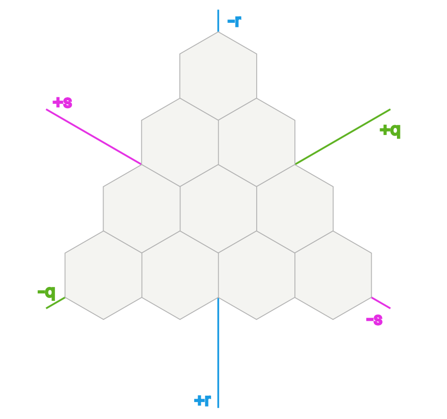
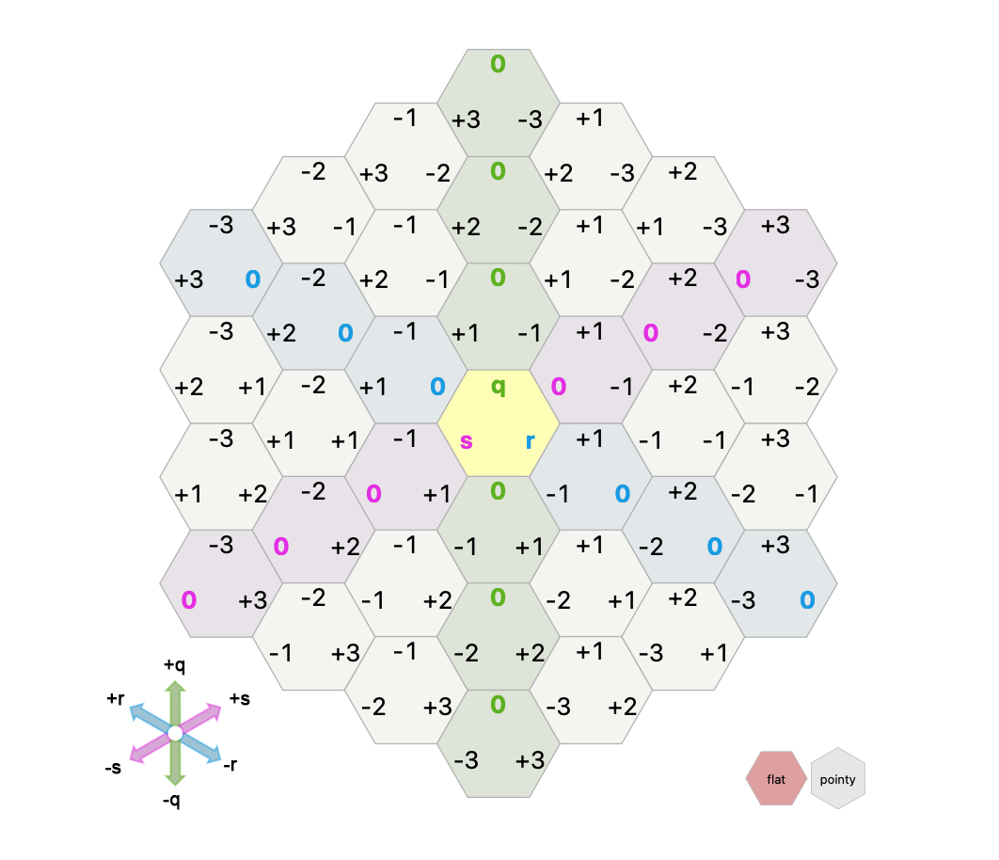

# Hive
> Nadia González Fernández C-412
>
> Luis Alejandro Lara Rojas C-412


## Introducción:
El proyecto implementa el juego Hive. 

### Tablero:
Para representar el tablero hexagonal del juego se utilizan 3 ejes prinmarios, en vez de dos como se utiliza en grids cuadrados.



Las coordenadas son:



## Correr Juego
*Nota:* Todos los comandos que se inserten deben terminar en ".".

Para inicializar hive debe en consola introducir:
```
swipl
```
```8
[main].
```
```
[start_game].
```

Se mostraran a continuación las reglas del juego y dará a escoger el modo de juego que desee

Este tiene cuatro modos:
- Jugador Blanco Vs. Máquina Negra. 
- Jugador Negra Vs. Máquina Blanco. 
- Jugador Vs. Jugador.
- Máquina Vs. Máquina.

Para iniciar la partida introduzca el número del modo deseado. Para iniciar en modo Jugador Blanco Vs. Máquina Negra debe escribir:
```
"1".
```

Las piezas se muestran de la siguente forma:
```
[COLOR TYPE Q R S]
```

Ejemplo:
```
[W Q 0 0 0]
```
Lo anterior representa la una pieza reina blanca en la posición (0, 0, 0).

La siguiente tabla contiene la leyenda del juego:

| Colores   |      |
| ---       | ---  |
| Blanco    | W    |
| Negro     | B    |

 Animal             | Init          | Move |
| ---               | ---           | ---  |
| Abeja Reina       | queen         | Q    |
| Escarabajo        | beetle        | B    |
| Saltamontes       | grasshopper   | G    |
| Araña             | spider        | S    |
| Hormiga Soldado   | ant           | A    |
| Mariquita         | ladybug       | L    |
| Mosquito          | mosquito      | M    |
| Bicho Bola        | pillbug       | P    |

### Movimientos
Para inicializar una pieza:
```
init animal Q R S
```
Ejemplo:
```
init queen 0 0 0
```

Para mover una pieza ya inicializada
```
move Q R S to NewQ NewR NewS
```
Ejemplo:
```
move 0 0 0 to 0 -1 1
```

El tablero se representa de la siguiente forma:
```
Pieces:
[W Q 0 0 0]
[B Q 0 -1 1]
[W B 1 0 -1]
```
En este caso el tablero sería:


	        	   0,-1,1
	        	  /     \
                 /   Q   \  
                 \       / 	 
                  \_____/ 
                  0,0,0  
                 /     \  
                /   Q   \ +1,0,-1
                \       / /     \  
                 \_____/ /   B   \
                         \       /
                          \_____/

*Nota:* Siempre puede consultar la imagen del tablero presentada anteriormente para cualquier duda sobre las posiciones.


## Estructura del proyecto

El proyecto tiene 

## Movimientos

## Inteligencia Artificial


## Bibliografía:
Coordenadas Cúbicas: https://www.redblobgames.com/grids/hexagons/